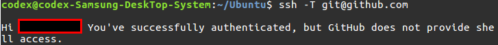

우분투 설정
===
<!--ts-->

* [Git](#GIT-Installation-and-Setting)
* [vim](#vim-Installation-and-Setting)
* [Ubuntu]
  * [root계정](#root)
  * [mouse accelerator turn off](#Mouse-setting)

<!--te-->

root
---

```
$sudo passwd root
```


Fire Fox Update
---

```shell
$sudo apt-get firefox
$sudo apt-get update
```


GIT Installation and Setting
---

```shell
설치
$sudo apt install git

초기 설정
$git config --global user.name "kimleepark"
$git config --global user.email kimleepark@gmail
//$git config -l

$ssh-keygen 
//.ssh 폴더안에 id_rsa.pub 의 내용을 Github ssh에 등록해준다.
$git init
$git log
//git 작업 기록
$git status
//git 현재 현황(add 되거나, 추적 가능한 파일 현황)
$git add
//-u 업데이트된 항목을 추적해서 add함,  --all,-A 폴더내 모든 항목을 add함
$git commit
$git push
//local -> remote 저장소로 이동
$git pull
//원격 저장소에 있는 변경 사항을 가져와서 merge함

```

>[Git 시작하기](https://git-scm.com/book/ko/v1/%EC%8B%9C%EC%9E%91%ED%95%98%EA%B8%B0-Git-%EC%B5%9C%EC%B4%88-%EC%84%A4%EC%A0%95) 를 참고 하시면서 작업 하시면 좋습니다.
>
>.gitignore 에 a.out, *.o, *.txt 등 을 추가하여 불필요한 형식은 걸러서 올리는것이 작업하기 편합니다.

>push 할때마다 아이디와 비밀번호 요구
>
>일단 이유를 알아야 하니 [여기](https://help.github.com/articles/why-is-git-always-asking-for-my-password/)참고해 주세요.
>[ssh key 생성부터 설정](https://help.github.com/articles/connecting-to-github-with-ssh/)
>
>```shell
>$ls -al ~/.ssh
>//기존에 키가 존재 하는지 체크해 주세요. 아마 대부분 이미 ssh-keygen으로 만드셨을겁니다.
>$ssh-keygen -t rsa -b 4096 -C "your_email@example.com"
>//이후 나오는 설정 "아~ 잘모르궤쎠 엔터 누르롸눈거 가튠뒈 잘 모르게쒀 걍 무조건 엔터"
>//뭐 순서대로 저장할 폴더, 패러프레이즈 에 대한 방식이니 그냥 엔터 눌러주세요.
>$cat ~/.ssh/id_rsa.pub
>//전부 복사해서 github sshkey 에 등록해주세요
>//등록후 조금 시간이 지나야 인증이 되니까 그동안 reboot해주세요
>$ssh -T git@github.com
>//Hi~~어쩌구 나오면 ssh에 등록되고 연결이 된거에요.
>```
>
>그리고 대부분 아마 push할때 마다 id 와 pass를 물어보는 경우는 git clone시에 ssh가 아닌 http로 clone을 해서 그렇습니다.
>그냥 간단하게 원래있던 폴더 삭제후
>clone할때에 ssh로 clone하시면 id&pass 안물어봄.


```shell
기존 로컬 저장소와 원격 저장소 연결
1.원격 저장소를 먼저 만들고 그냥 Clon
$git clone https://원격저장소.git

2.기존로컬 저장소를 원격저장소와 연결
Github에서 resipotory를 먼저 만들어야 한다.
$mkdir "resipotory와 같은 이름"
//resipotory 이름은 foo라고 가정한다.
$cd foo
$git init
//빈저장소를 만드는것
$git remote <name> <https://원격저장소.git>
//name 간단하게 push할때마다 사용하는 브랜치 이름이다.
$git remote show <name>
//분명 HEAD 브랜치 : (unknown) 이라고 나올것이다. 
$git push <name> master
```


Autojump Installation
---

```shell
$sudo apt-get install autojump
//Ubuntu에는 패키지가 있어서 apt-get으로 설치 가능
$sudo apt-get update
$autojump
//분명 이부분에서 osX든 ubuntu든 bach 설정이 안되어 있어서 뭐라뭐라 나옴
$echo ". /usr/share/autojump/autojump.bash" >> ~/.bashrc
//autojump가 터미널 실행시 바로 작동 할수 있게 경로를 추가해 줘야 한다.
```

>[Autojump](https://github.com/wting/autojump) 를 참고하시길 바랍니다.


vim Installation and Setting
---

```shell
설치
$sudo apt-get vim
$sudo apt-get update
```
>후...여러가지 준비해봤습니다. 제대로 모시겠습니다.[Vim 설정](./vim/Mac_vim_setting)


Mouse setting
---
```shell
시스템 설정 -> 마우스 설정 에 마우스 속도 조절이 없다....
1. rc.local에 스크립트 파일 등록 [적용안됨]
	
2. init.d에 스크립트 파일 등록 [적용안됨]
	Runlevel=5	

#1~2번 까지 systemctl 로 상태를 확인해본 결과 똑같은 오류 메세지 나옴
unable to open display "" 이런식임
방법을 찾다가 display가 뜻하는것은 서버등 내 서버에 접속된 사용자들의 display 같음 하지만 난 솔플을 하는중이니
$echo $DIPLAY
:0
일케 나옴 그러니당연히 매번 unable~ 이런식으로 오류를 던져줌
[해결]
	export XAUTHORITY=/home/codex/.Xauthority
	sh & xset -display :0 m 1/2 1/2
	현재 내 display에 대한 정보와 권한을 가져오는것이 방법이였다.
	근데 중요한건 결국 안됨....rc.local의 실행과정을 보니 parent에서 fork하는것이였고 현재 쉘에는 적용 안됨...

3.autostart에 스크립트 등록 [적용안됨]

4.autostart에 mate-mouse-property [적용됨]
	근데 부팅되자마자 앱 화면이 로드됨
5. 런치패드 업데이트 [안됨]
6. 우분투 업데이트 [안됨]
7. Gnome으로 변경후 업데이트 [됨]
```