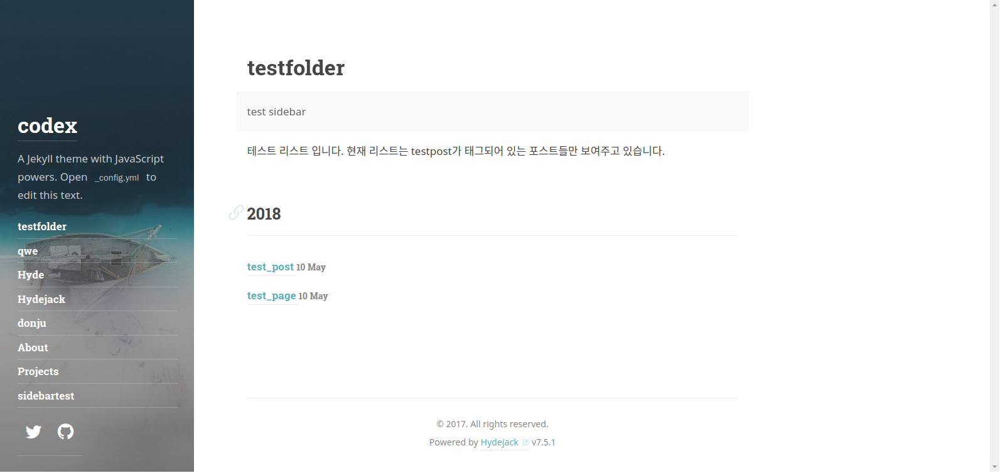

```c
1. 페이지 만들기
2. 
```
## Table contents
{:.no_toc}
0. this unordered seed list will be replaced by toc as unordered list
{:toc}


## jekyll directory structure

지킬 기본 디렉토리 구조는 이런식입니다. 
기본 구조를 알아두고 적용하고 싶은 테마에 구조와
비교해보면서 알아가는게 이해가 빠를것 같습니다.
```shell
.
├── _config.yml (지킬 환경설정 정보)
├── _drafts (아직 게시하지 않은 초안으로 파일명 형식에 날짜가 없음)
|   ├── begin-with-the-crazy-ideas.textile
|   └── on-simplicity-in-technology.markdown
├── _includes (포스트 레이아웃이 들어 있는 폴더, 레이아웃의 헤더파일 같은것)
|   ├── footer.html
|   └── header.html
├── _layouts (실제 레이아웃이 존재하는 폴더, Liquid 태그를 사용함)
|   ├── default.html
|   └── post.html
├── _posts (게시한 포스트를 저장하는곳,날짜 명칭 형식을 반드시 맞춰야함)
|   ├── 2007-10-29-why-every-programmer-should-play-nethack.textile
|   └── 2009-04-26-barcamp-boston-4-roundup.textile
├── _data (사이트에 사용될 데이터가 저장되어 있는곳)
|   └── members.yml (site.data.members 라고 입력하면 해당 데이터 사용가능)
├── _site (지킬이 변환작업을 마친 포스트가 저장되는곳)
├── .jekyll-metadata (지킬이 동작하면서 빌드내역등에 대한 정보를 저장)
└── index.html (yaml 머리말을 세션을 가진 모든 파일을 찾아 변환작업함)
```
hydejack 구조

> 지킬도 분명 `index.html`을 우선으로 보여줄것이다. 근데 지킬은 index.md를 우선시한다.
>
> 기본구조에서 [index.md](#index.md-of-location) 가 존재하는곳이 어딘지 보면 알기 쉽다.

```shell
├──_data
├──_featured_categories
├──_featured_tags
├──_includes
├──_js
├──_layouts
├──_posts
├──_sass
├──assets (이미지 문서등 자원폴더)
├──_config.yml
├──404.md
├──about.md
└──index.html
```


## Config

> _config.yml

* Github page
  깃허브 페이지에 호스팅 할때 url형식은  http://<username>.github.io 의기본형식을 따른다.
  (따로 도메인을 설정하지 안았을때)
  baseurl 은 당신이 호스팅한 페이지에 따라 달라진다.


##Page
>거의 모든 웹환경의 설정은 루트폴더에서 index.html 인 파일을 찾아 홈페이지로 보여줌
>물론 지킬도 이런 관례를 따름

* 페이지의 위치
  html을 생성하는 위치에 따라 두가지 방법있음.
  1. 사이트의 루트 폴더에 각 페이지병 HTML을 만든다.
  2. 사이트의 루트 폴더에 각 페이지 별 폴더를 만들고, 각 폴더에  index.html 파일을 만든다.(이게 좋아 보임)

* HTML파일에 이름쓰기

  루트 디렉토리에 생성하고자 하는 페이지 이름을 가진 HTML파일을 추가하는것

```shell
 .
 |-- _config.yml
 |-- _includes/
 |-- _layouts/
 |-- _posts/
 |-- _site/
 |-- about.html    # => http://yoursite.com/about.html
 |-- index.html    # => http://yoursite.com/
 └── contact.html  # => http://yoursite.com/contact.html
```

* 디렉토리에 이름을 짓고 인덱스 HTML파일 넣기

  루트 폴더에 페이지마다 폴더를 만들고 그안에 index.html을  넣어주는것이 단순해 지고 관리가 쉬워짐
```shell
  .
├── _config.yml
├── _includes/
├── _layouts/
├── _posts/
├── _site/
├── about/
|   └── index.html  # => http://yoursite.com/about/
├── contact/
|   └── index.html  # => http://yoursite.com/contact/
└── index.html      # => http://yoursite.com/
```
## List


##hydejack 에서 side bar 추가하기
```shell
---
layout: page  =>page 와 list중에 어울리는걸로 하면될듯 
title: test_page =>사이드바에 표시될 이름
description: >  => 해당 사이드바에 대한 설명
test sidebar => 여기부분부터 쓸때 반드시 스페이스바로 두칸 띄고 써야됨. 절대 탭이나 적거나 많게 띄면 에러남
menu: true =>이 속성을 넣어줘야 사이드바에 나타남
order: 7 => 사이드 바에서 표시될 순서임
---
#사이드바에 추가하고 싶으면 폴더 이름은 아무거나 상관없음
#폴더 안에 index.md가 있어야 하고 위의 yaml 헤더가 있어야함.
```
1. _featured_tags
   anytitle.md 를 만들고 위의 내용 넣어주면됨.

2. 폴더에 index.md 만들기
   anytitle.md 만들고 위의 내용 넣어주면됨.


## Sidebar&page&list example
```shell
#먼저 testfolder를 사이드바에 추가하기 위해
#루트 위치에 같은 폴더 명을 만들어줬습니다. 물론 폴더명을 동일하게 만든것은
#그냥 보기 이쁘고 관리 하기 편할것 같아서 그런거지 굳이 일치 시킬필요는 없습니다.
$ tree -L 2
.
...
├── testfolder
    ├──index.md
├── _post
    ├──...
    ├──2018-05-05-testpost.md
    ├──2018-05-05-testpage.md
    ├──...
└── ...
#저는 사이드바에 추가된 testfolder에 testpost로 태그된 목록들을 보여주려합니다.
#물론 _post폴더 안의 testpost 와 testpage도 testpost로 태그되어 있습니다.
```

그럼 이제 밑의 사진 처럼 구성이 되어 있을것입니다.



이제 각 폴더와 파일들을 상세하게 살펴보면 될것같습니다.

1. testfolder
   테스트 폴더 안에는 index.md가 있습니다. 테마의 내부설정에 의해서 index.md를 우선으로  
   읽어 오고 yaml헤더에 따라 용도와 방법이 구분됩니다.

```shell
#index.md
---
layout: list
title: testfolder
slug: testpost
description: >
     test sidebar
menu: true
order: 1
---
테스트 리스트 입니다.
현재 리스트는 testpost가 태그되어 있는 포스트들만 보여주고 있습니다.
```
   * layout : list로 설정 하셔야 해당 태그로 연결된 포스트들을 보여줍니다.
   * slug : 슬러그에 설정된 이름으로 관련된 태그를 가져옵니다.
   * menu : sidebar에 추가 하기 위해선 true로 해줘야 합니다.
   * order : 사이드바에서 보여질 순위입니다. 위의 그림에서 보면 첫번째로 위치함.  


2. 태그된 포스트들

   현재는 두가지의 다른 포스트를 준비했습니다.

```shell
#2018-05-05-testpost.md
---
layout: post
title:  test_post
date:   2018-05-10 16:06:59 +0900
tag: [testpost]
---
테스트 포스트입니다. 현재 태그는 testpost입니다.
   
#2018-05-05-testpage.md
---
layout: page
title:  test_page
date:   2018-05-10 16:06:59 +0900
tag: [testpost]
---
테스트 페이지입니다. 현재 태그는 testpost입니다.   
```

   

>Github page defendency 문제 해결
>Gemfile 에 다음 내용 추가
```sh
require 'json'
require 'open-uri'
versions = JSON.parse(open('https://pages.github.com/versions.json').read)
gem 'github-pages', versions['github-pages']
```
```shell
$ bundle update
$ bundle install
```
[Github Defendency version](https://pages.github.com/versions/)


[카테고리 페이지 나누기](https://pengpengto.gitlab.io/blog/tech/2017/06/08/jekyll-category_pagination.html)


#####index.md of location
```shell
.
├── _data
├── _featured_tags
├── _includes
├── _js
├── _layouts
├── _posts
├── _sass
├── _site
├── assets
├── docs
│   └── 7.5.1
│       └── index.md
├── index.md
└── licenses

```


#####Whole structure
```shell
.
├── Gemfile
├── Gemfile.lock
├── LICENSE.md
├── NOTICE.md
├── _config.yml
├── _data
├── _featured_tags
├── _includes
├── _js
├── _layouts
├── _posts
├── _projects
├── _sass
├── _site
├── about.md
├── assets
├── docs
├── index.html
├── index.md
├── licenses
└── posts.md

```

