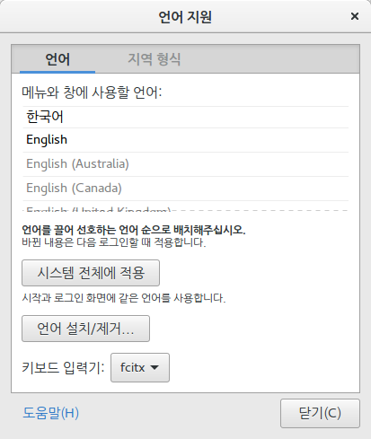

# Ubuntu 16.04LTS 설치후 설정

[TOC]

## Ubuntu partitioning

이번엔 LVM시스템으로 설치를 진행 했다.

* swap : 8GB
* boot : 256MB
* root : 20GB
* home : 100GB
* var : 5GB
* tmp : 5GB

부팅 드라이브는 실제 내가 우분투를 설치하고 있는 드라이브를 잡아주면 된다.

그냥 개인 컴퓨터로 사용할것이기 때문에 home에 다 때려 박았다.

LVM이니까 나중에 확장하거나 축소 할때 편할것 같다.


## Update

우분투를 설치후 반드시 업데이트를 해줘야 한다.

특히 16.04이하의 버전에서는 한영 키를 사용해서 변환시키는게

안되거나 이상한 방법들을 사용했었다.

물론 ibus, fcitx도 따로 설치하고 언어팩도 다 새로 잡아줘야 했었는데,

16.04LTS에서부터는 업데이트만 해주면 한영키도 제대로 잡힌다.

```shell
$ sudo apt-get update
```

업데이트 하시는 김에 이것저것 풀 패키지로 설치하고 혹여나 듀얼 부팅 하시는 분들 GRUB에서 이미지를

잡아주고 해야하는데 

```shell
$ sudo apt update --fix-missing
```

사실상 요고 한방에 boot-repair 안해줘도 됩니다.


## GRUB 설정

필자는 본체에 듀얼 부팅을 하고 있었다.

처음 우분투를 설치하고 부팅을 해보면 GRUB에 우분투만 나오고

윈도우는 안나온다.

때문에 윈도우로도 부팅이 가능하게 해줘야 하는데 `boot-repair`를 써주면된다.

```shell
$ sudo add-apt-repository ppa:yannubuntu/boot-repair
$ sudo apt-get update
$ sudo apt-get install boot-repair 
$ sudo boot-repair
# 실행후 추천 복구 클릭해주면 끝
$ ehco http://paste.ubuntu.com/p/JSg7bd3dWx/ > log.txt
```


## 한글설정 관련

우분투가 상당히 좋아져서 설치시 한글로 설치만 해도 왠만한 패키지는 알아서 설정된는듯하다.

근데, ibus가 기본으로 설정 되어 있는데 sublime text에서 한글 입력이 안되는 문제 발생.

혹여나 gnome 업데이트후 한글키(한글 토글키) 안됨.


> 설정 -> 지역 및 언어 ->  입력 소스 추가


> 설정 -> 키보드-> 바로가기


위의 구성처럼 똑같이 만들어 주시면 됩니다.


현재 Ubuntu - gnome 16.04 LTS는 ibus 언어입력기를 사용하고 있는데 이러면 sublimetext에서 사용이 불가 합니다.

때문에 언어 선택기를 설치하고 fcitx를 설정해줘야 합니다.

```shell
$ sudo apt install language-selector-gnome
$ gnome-language-selector
```



화면처럼 fcitx를 선택해주세요.

그리고 리부트.


## Sublime Text

[https://www.sublimetext.com/](https://www.sublimetext.com/) 뭐든 공홈을 뒤져보는 습관을 들이자.

대부분 앱들은 내가 접속한 운영체제에 맞게 설치 매뉴얼을 바로 보여준다.

```shell
# stable version install
$ wget -qO - https://download.sublimetext.com/sublimehq-pub.gpg | sudo apt-key add -
Ensure apt is set up to work with https sources:

$ sudo apt-get install apt-transport-https

$ echo "deb https://download.sublimetext.com/ apt/stable/" | sudo tee /etc/apt/sources.list.d/sublime-text.list

$ sudo apt-get update

$ sudo apt-get install sublime-text
```


### Package contorol


그리고 서브라임을 쓰는 이유는 다양한 패키지 들인데 패키지들도 설정해 주자.

[https://packagecontrol.io/installation#st3](https://packagecontrol.io/installation#st3) 여기에 가면 패키지 설정에 입력해야 하는 내용이 나온다.

고대로 복사하자.

```c
import urllib.request,os,hashlib; h = '6f4c264a24d933ce70df5dedcf1dcaee' + 'ebe013ee18cced0ef93d5f746d80ef60'; pf = 'Package Control.sublime-package'; ipp = sublime.installed_packages_path(); urllib.request.install_opener( urllib.request.build_opener( urllib.request.ProxyHandler()) ); by = urllib.request.urlopen( 'http://packagecontrol.io/' + pf.replace(' ', '%20')).read(); dh = hashlib.sha256(by).hexdigest(); print('Error validating download (got %s instead of %s), please try manual install' % (dh, h)) if dh != h else open(os.path.join( ipp, pf), 'wb' ).write(by)
```

복사한 코드는 서브라임을 연후

> ctrl+` 를 눌러서 입력해준후 엔터를 쳐주자

그리고 파레트를 열어서 내가 원하는 패키지들을 설치해 주면 된다.

> ctrl+shift+p 후 pci 검색 하면 package control install 이 나옴 엔터 후 내가 원하는 패키지 설치 


### 한글 입력 문제

os 안에서 한글 입력 문제를 fcitx로 해결해 준후, sublime 에서 한글을 입력하고 하니 되질 안는다.

걱정 할것 없다.

뜻이 있는곳에 길이 있나니...

구글링이 있는곳에 해답이 있었다. 나니?!!

아주 고마우신 분들이 이미 솔루션을 만들어 놨다.

[https://github.com/lyfeyaj/sublime-text-imfix](https://github.com/lyfeyaj/sublime-text-imfix)

```shell
$ git clone https://github.com/lyfeyaj/sublime-text-imfix
$ cd sublime-text-imfix
$ ./sublime-imfix
$ sudo reboot
```


### 유용한 패키지 목록

Autocomplete

BracketHighlighter

GitGutter

SideBarEnhancements

SublimeLinter


### Theme

[Material Theme](https://packagecontrol.io/packages/Material%20Theme)


### Reindent

> Preferences -> Key Bindings -> User

```c
// 다음 내용을 추가해 준다.
// 단축키는 본인이 원하는거 아무거나 넣어 주면된다.
{ "keys": ["ctrl+shift+r"], "command": "reindent"}
```


## Typora

문서 작성중에 마크다운에 빠진 이후로 타이포라를 애용해 주고 있다.

정말 편하다.

[https://typora.io/#linux](https://typora.io/#linux) 공홈을 참고 해보자.

```shell
# optional, but recommended

sudo apt-key adv --keyserver keyserver.ubuntu.com --recv-keys BA300B7755AFCFAE

# add Typora's repository

sudo add-apt-repository 'deb https://typora.io/linux ./'

sudo apt-get update

# install typora

sudo apt-get install typora
```


## Variety

버라이어티는 배경화면을 수시로 바꿔주는 앱이다. 다양한 기능들이 있지만 배경을 바꿔 주는것과 명언이 나오는것이 너무 맘에 든다.

[https://peterlevi.com/variety/](https://peterlevi.com/variety/) 참고하자

```shell
$ sudo add-apt-repository ppa:peterlevi/ppa
$ sudo apt-get update
$ sudo apt-get install variety variety-slideshow
```


## Shutter

> 셔터는 스샷용 앱이다. 윈도우 유저들은 픽픽등 다양한 스샤용 앱을 사용하는것으로 알고 있다.

[http://shutter-project.org/downloads/](http://shutter-project.org/downloads/) 공홈도 참고해 보자

```shell
# install stable version
$ sudo add-apt-repository ppa:shutter/ppa
$ sudo apt-get update && sudo apt-get install shutter
```

그리고 셔터를 전역키에서 사용하기 위해 거쳐야 하는작업이 있다.

셔터의 사용법을 알아 보자면

```shell
# 마우스로 스크롤한 화면 스샷 select
$ shutter -s
# 선택 창 스샷 window
$ shutter -w
# 전체 화면 스샷 full
$ shutter -f
```

위의 설정 들을 키보드설정에 넣어줘야함.

> 설정 -> 키보드 -> 사용자설정 바로가기


이런식으로 설정해 주면 된다.


## Chrome 

[https://www.google.com/chrome/](https://www.google.com/chrome/) 뭐든 공홈을 참고하는건 필수다.

공홈에서 deb 파일을 받아서 설치 하면 될것 같지만 왠지 모르게 안된다.

때문에 터미널에서 수동으로 설치해줘야하는데 고대로 따라하면 된다.

우선 여기를 참고해 보자 [https://www.linuxbabe.com/ubuntu/install-google-chrome-ubuntu-16-04-lts](https://www.linuxbabe.com/ubuntu/install-google-chrome-ubuntu-16-04-lts)되게 잘정리 되어 있다.

```shell
$ sudo nano /etc/apt/sources.list
#다음 내용 추가
deb [arch=amd64] http://dl.google.com/linux/chrome/deb/ stable main

$ wget https://dl.google.com/linux/linux_signing_key.pub
$ sudo apt-key add linux_signing_key.pub
$ sudo apt update
$ sudo apt install google-chrome-stable
$ sudo apt update

```


아마 업데이트를 하면 이상한 오류들을 볼텐데

> Target Packages (main/binary-amd64/Packages) is configured multiple times

이런식의 오류가 미친듯이 뜰것이다.

걱정 할것 없다.

원인을 보자면 크롬 패키지가 설치 되면서 `/etc/apt/sources.list.d/google-chrome.list` 을 만들어 내는데 이걸 삭제해 주면된다.

```shell
$ sudo rm /etc/apt/sources.list.d/google-chrome.list
```

매우 설치가 잘된다.

설치 후에 런처에 크롬이 보이지 않는다고 떨면 안된다.

침착하게 Super+A를 눌러보자 크롬이 보일것이다.


## Autojump

오토점프는 터민널 상에서 Fast directory change를 가능하게 해준다.

[https://github.com/wting/autojump](https://github.com/wting/autojump)

```shell
$ git clone https://github.com/wting/autojump
$ cd autojump
$ ./install.sh
...
Please manually add the following line(s) to ~/.bashrc:
#밑의 내용을 .bashrc에 추가해 주면된다.
	[[ -s /home/codex/.autojump/etc/profile.d/autojump.sh ]] && source /home/codex/.autojump/etc/profile.d/autojump.sh
...
$ exec "$SHELL"
```


## Gnome

[https://thelinuxcode.com/install-gnome-desktop-environment-ubuntu-16-04/](https://thelinuxcode.com/install-gnome-desktop-environment-ubuntu-16-04/) 을 참고해 보자.

[https://b.chalk.pe/posts/setting-up-ubuntu-gnome-16-04/](https://b.chalk.pe/posts/setting-up-ubuntu-gnome-16-04/) 이분도 굉장히 잘 정리해 주셨다.

```shell
# gnome install
$ sudo apt-get update
$ sudo apt-get dist-upgrade
$ sudo apt-get install gnome-panel
$ sudo apt install gnome
$ sudo reboot
```


이제 gnome 3.2버전으로 업데이트 해보자

## gnome 3.2 update

[https://launchpad.net/~gnome3-team/+archive/ubuntu/gnome3-staging/+index?batch=75&direction=backwards&memo=225&start=150](https://launchpad.net/~gnome3-team/+archive/ubuntu/gnome3-staging/+index?batch=75&direction=backwards&memo=225&start=150) 

위의 링크에 최신 Gnome3에 대한 ppa version과 설치 방법이 나온다.

참고 바란다.

```shell
$ sudo add-apt-repository ppa:gnome3-team/gnome3-staging
$ sudo apt-get update
$ sudo apt dist-upgrade
$ sudo reboot
$ sudo apt-get install gnome-shell
$ sudo apt-get install ubuntu-gnome-desktop
gzip: stdout: No space left on device
E: mkinitramfs failure cpio 141 gzip 1
update-initramfs: failed for /boot/initrd.img-4.15.0-32-generic with 1.
dpkg: error processing package initramfs-tools (--configure):
 설치한 post-installation 스크립트 하위 프로세스가 오류 1번을 리턴했습니다
처리하는데 오류가 발생했습니다:
 initramfs-tools
E: Sub-process /usr/bin/dpkg returned an error code (1)
##오류 나옴
```

해당 오류는 /boot 디렉토리에서 필요없는 커널 버전이 자리를 차지하고 있어서 문제가 발생한듯 싶다.

```shell
$ sudo apt update
...
  amd64-microcode intel-microcode iucode-tool libllvm4.0
를 삭제하라고 나온다. 삭제해 주자.
$ sudo apt autoremove amd64-microcode intel-microcode iucode-tool libllvm4.0

```


허나 막상 설치하고 나면 화면이 유니티+ gnome 의 혼종느낌이 든다.

뭘까? 확인해 보자.

```shell
$ sudo dpkg-reconfigure gdm3
```


[Lightdm Vs GDM](https://unix.stackexchange.com/questions/131496/what-is-lightdm-and-gdm)

[Switching lightdm and gdm](https://itsfoss.com/switch-gdm-and-lightdm-in-ubuntu-14-04/)

[https://itsfoss.com/how-to-install-gnome-in-ubuntu-14-04/](https://itsfoss.com/how-to-install-gnome-in-ubuntu-14-04/)

[https://thelinuxcode.com/install-gnome-desktop-environment-ubuntu-16-04/](https://thelinuxcode.com/install-gnome-desktop-environment-ubuntu-16-04/)


## boot 파티션이 가득 찼다고 오류 나올때

> 아무래도 boot-repair때문에 생기는 문제 같다. 우분투를 몇번씩 지웠다가 재설치 하면서 생긴 문제 인듯하다.

[http://sangwonleee.tistory.com/entry/ubuntu-1604-boot-%ED%8C%8C%ED%8B%B0%EC%85%98-%EA%B0%80%EB%93%9D%EC%B0%BC%EC%9D%84-%EB%95%8C](http://sangwonleee.tistory.com/entry/ubuntu-1604-boot-%ED%8C%8C%ED%8B%B0%EC%85%98-%EA%B0%80%EB%93%9D%EC%B0%BC%EC%9D%84-%EB%95%8C)

[https://askubuntu.com/questions/345588/what-is-the-safest-way-to-clean-up-boot-partition](https://askubuntu.com/questions/345588/what-is-the-safest-way-to-clean-up-boot-partition)

https://ubuntuforums.org/showthread.php?t=2355357


최신 커널을 제외한 커널들을 모두 삭제해 줘야 한다.

```shell
$ uname -r
4.15.0-32-generic
# 현재 내가 쓰고 있는 최신버전의 커널을 확인 할수 있다.
$ dpkg --list 'linux-image*'
희망상태=알수없음(U)/설치(I)/지우기(R)/깨끗이(P)/고정(H)
| 상태=아님(N)/설치(I)/설정(C)/풀림(U)/절반설정(F)/일부설치(H)/트리거대기(W)/
| /    트리거밀림(T)
|/ 오류?=(없음)/다시설치필요(R) (상태, 오류가 대문자=불량)
||/ 이름                                   버전                 Architecture 설명
+++-======================================-====================-============-===============================================================
un  linux-image                            <none>               <none>       (설명 없음)
ii  linux-image-4.10.0-28-generic          4.10.0-28.32~16.04.2 amd64        Linux kernel image for version 4.10.0 on 64 bit x86 SMP
ii  linux-image-4.15.0-30-generic          4.15.0-30.32~16.04.1 amd64        Signed kernel image generic
ii  linux-image-4.15.0-32-generic          4.15.0-32.35~16.04.1 amd64        Signed kernel image generic
iF  linux-image-4.4.0-133-generic          4.4.0-133.159        amd64        Linux kernel image for version 4.4.0 on 64 bit x86 SMP
ii  linux-image-extra-4.10.0-28-generic    4.10.0-28.32~16.04.2 amd64        Linux kernel extra modules for version 4.10.0 on 64 bit x86 SMP
iU  linux-image-extra-4.4.0-133-generic    4.4.0-133.159        amd64        Linux kernel extra modules for version 4.4.0 on 64 bit x86 SMP
iU  linux-image-generic                    4.4.0.133.139        amd64        Generic Linux kernel image
ii  linux-image-generic-hwe-16.04          4.15.0.32.54         amd64        Generic Linux kernel image
un  linux-image-unsigned-4.15.0-30-generic <none>               <none>       (설명 없음)
un  linux-image-unsigned-4.15.0-32-generic <none>               <none>       (설명 없음)

## 이전 커널 버전들이 활개 치는것을 볼수 있다.
# 최신 커널버전을 제외한 모든 커널을 숙청해주자.
$ sudo apt-get purge linux-image-4.10.0-28-generic linux-image-4.15.0-30-generic linux-image-4.4.0-133-generic linux-image-extra-4.10.0-28-generic linux-image-extra-4.4.0-133-generic linux-image-generic linux-image-generic-hwe-16.04 linux-image-unsigned-4.15.0-30-generic linux-image-unsigned-4.15.0-32-generic
$ df |grep /boot
Filesystem     1K-blocks    Used Available Use% Mounted on
/dev/sdb6         236876   82079    138260  38% /boot
#사용량이 줄었다

```

 


## GTK+ install

[https://developer.gnome.org/gtk3/stable/gtk-building.html](https://developer.gnome.org/gtk3/stable/gtk-building.html) 

참고 바란다.

```shell
$ tar xvfJ gtk+-3.2.0.tar.xz
$ cd gtk+-3.2.0
$ ./configure --prefix=/opt/gtk
$ sudo apt-get install libgtk-3-dev
```

[https://wiki.ubuntu.com/UbuntuGNOME/HowTo/Korean#GNOME_Shell_.2BwtzHkdVYrjA-](https://wiki.ubuntu.com/UbuntuGNOME/HowTo/Korean#GNOME_Shell_.2BwtzHkdVYrjA-)


## Gnome extension

### Dash to dock

맥처럼 간지나게 바꿔 주자.


## 후기 

참 생고생을 다한것 같다....

사실 제글을 끝까지 읽어주신 여러분들 을 위해 사실대로 고하겠습니다.

그냥 업그레이드 하지 마시고, gnome 용 ubuntu를 설치하세요,...

[https://ubuntugnome.org/](https://ubuntugnome.org/) 여기를 참고하시면서 [여기에서 iso 다운받으시면 됩니다.](https://wiki.ubuntu.com/XenialXerus/ReleaseNotes/UbuntuGNOME)

그럼 위의 과정 단 한개도 거치지 안아도 됩니다. ㅠㅠ


[블로그 설치 참고](https://b.chalk.pe/posts/setting-up-ubuntu-gnome-16-04/)

